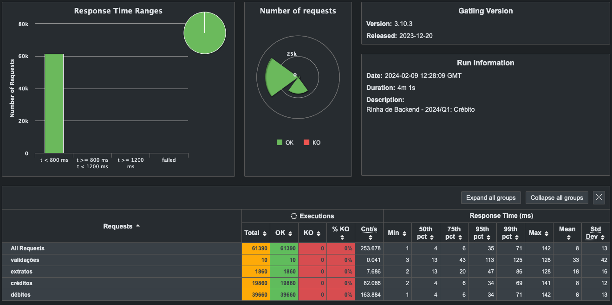

<h1 align="center">Rinha de Backend 2014/Q1 - Implementação</h1>

<table border=0>
<tr>
    <td></td>
    <td>
    <td></td>
    <td></td>
</tr>
</table>

Implementação da [Rinha de Backend 2024/Q1](https://github.com/zanfranceschi/rinha-de-backend-2024-q1)


## Autor

[Danilo Silva](https://www.github.com/Danilo-Oliveira-Silva)

[](https://www.linkedin.com/in/danilodevs/)
[](https://twitter.com/danilosdev)

## Rodando o Projeto

Clone o repositório

```shell
git clone git@github.com:Danilo-Oliveira-Silva/rinha-backend-2024-poc.git
```

Acesse o diretório

```shell
cd rinha-backend-2024-poc
```
    
Suba os containers

```shell
docker compose up -d --build
```

⚠️ O compose expõe as portas 9999 para o load balancer e 27017 para o MongoDB. Garanta que as mesmas estejam livres antes de subir os containers.

## Resultado dos testes




## Documentação da API

 `/clientes/{ClienteId}/transacoes`

Rota utilizada para cadastrar uma nova transação

<table>
    <tr>
        <th>Request</th>
        <th>Status</th>
        <th>Response</th>
        <th>Observações</th>
    </tr>
    <tr>
        <td>
            <pre lang="json">      
{
    "valor": 10000,
    "tipo" : "d",
    "descricao" : "descricao"
}
            </pre>
        </td>
        <td>200</td>
        <td>
            <pre lang="json">
{
    "limite": 80000,
    "saldo": -80000
}
            </pre>
        </td>
        <td>Request com sucesso</td>
    </tr>
     <tr>
        <td>
            <pre lang="json">      
{
    "valor": 10000,
    "tipo" : "d",
    "descricao" : "descricao"
}
            </pre>
        </td>
        <td>404</td>
        <td>
            <pre lang="json">
{
    "message": "Cliente não encontrado"
}
            </pre>
        </td>
        <td>Cliente Id informado na URL inexistente</td>
    </tr>
 <tr>
        <td>
            <pre lang="json">      
{
    "valor": 10000,
    "tipo" : "x",
    "descricao" : "descricao"
}
            </pre>
        </td>
        <td>422</td>
        <td>
            <pre lang="json">
{
    "message": "Erro no processamento"
}
            </pre>
        </td>
        <td>Erro em validações de dados<br />Erro de saldo insuficiente</td>
    </tr>

</table>

 `/clientes/{ClienteId}/extrato`

Rota utilizada para ver o extrato de um cliente

<table>
    <tr>
        <th>Request</th>
        <th>Status</th>
        <th>Response</th>
        <th>Observações</th>
    </tr>
    <tr>
        <td>(vazio)</td>
        <td>200</td>
        <td>
            <pre lang="json">
{
	"saldo": {
		"total": -80000,
		"data_extrato": "2024-02-08T20:41:53.285497Z",
		"limite": 80000
	},
	"ultimas_transacoes": [
		{
			"valor": 10000,
			"tipo": "d",
			"descricao": "descricao",
			"realizada_em": "2024-02-08T20:18:12.041Z"
		},[...]
	]
}
            </pre>
        </td>
        <td>Request com sucesso</td>
    </tr>
     <tr>
        <td>(vazio)</td>
        <td>404</td>
        <td>
            <pre lang="json">
{
    "message": "Cliente não encontrado"
}
            </pre>
        </td>
        <td>Cliente Id informado na URL inexistente</td>
    </tr>
</table>